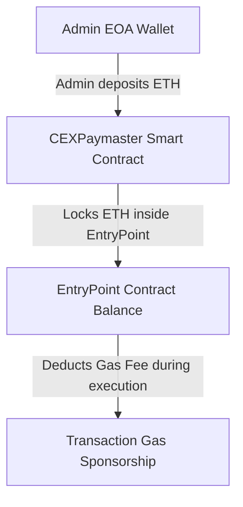
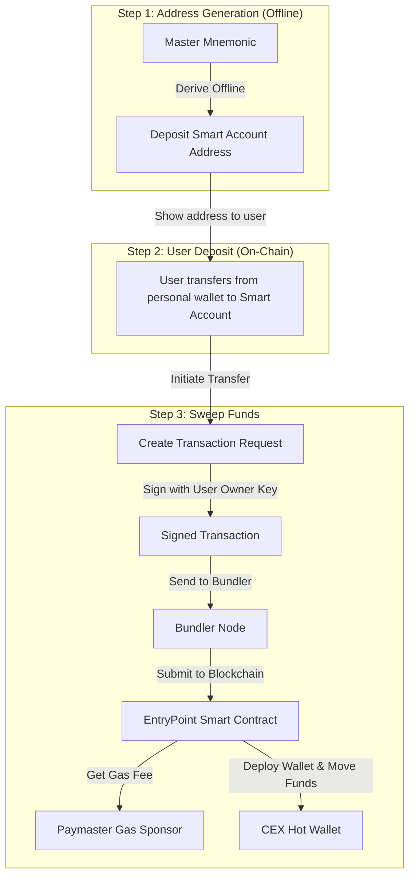

# ERC-4337 CEX Sweeper: Step-by-Step Architecture Guide

This document explains the workflow of the ERC-4337 Smart Account deposit and sweeping system.

---

## 1. Step-by-Step Flow Explanation

### Step 1: Predict Address (Offline)
*   **Goal:** Create a deposit address for a new user.
*   **How it works:** The CEX backend derives the user's `Smart Account Address` offline directly from the master seed phrase (Mnemonic) using the counterfactual prediction formula.
*   **Cost:** **$0 Gas** (nothing is deployed on-chain yet).

---

### Step 2: User Deposit
*   **Goal:** The user funds their CEX deposit address.
*   **How it works:** 
    1. The user transfers funds from their external personal wallet (like MetaMask or another exchange) directly to the predicted `Smart Account Address`.
    2. The funds sit safely at that address on-chain.
*   **Gas Fee:** The user pays the standard fee to transfer funds from their personal wallet to the Smart Account .

---

### Step 3: Sweep Funds (Sponsored by CEX Paymaster)
*   **Goal:** Move the deposited funds from the user's Smart Account to the CEX main Hot Wallet.
*   **How it works:**
    1. The CEX backend creates a **UserOperation** (transaction request) to transfer the funds to the CEX Hot Wallet.
    2. The CEX backend signs this request offline using the user's derived owner private key.
    3. The signed request is sent to the **Bundler**.
    4. The Bundler executes it on-chain.
    5. The **Paymaster** pays the gas fee for this sweep transaction. The Smart Account transfers the funds to the CEX Hot Wallet.
*   **Gas Fee:** Sponsored entirely by the CEX Paymaster. No pre-funding is required at the user's Smart Account address.

---

## 2. Paymaster Funding & Gas Sponsorship Flow

This section explains how gas fees are paid behind the scenes without the user's Smart Account having any ETH:

1. **Admin Pre-funding:** The CEX Admin EOA wallet sends ETH to the `CEXPaymaster` smart contract to fund the gas sponsorship pool.
2. **On-Chain Lock:** The `CEXPaymaster` contract locks this ETH inside the `EntryPoint` contract balance under the Paymaster's address (`depositTo`).
3. **Execution Sponsorship:** During a sweep transaction, the `EntryPoint` checks if the sender is whitelisted by the `CEXPaymaster`. 
4. **Gas Deduction:** If approved, the `EntryPoint` executes the sweep and deducts the gas fee directly from the `CEXPaymaster`'s locked balance inside the EntryPoint.

---

## 3. System Flowchart

Here is the visual diagram of the system flow:

